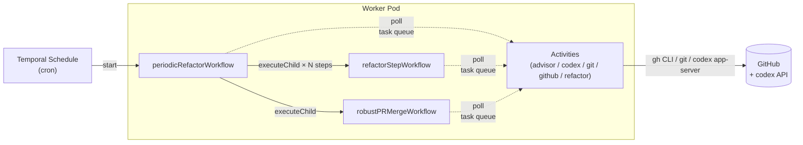
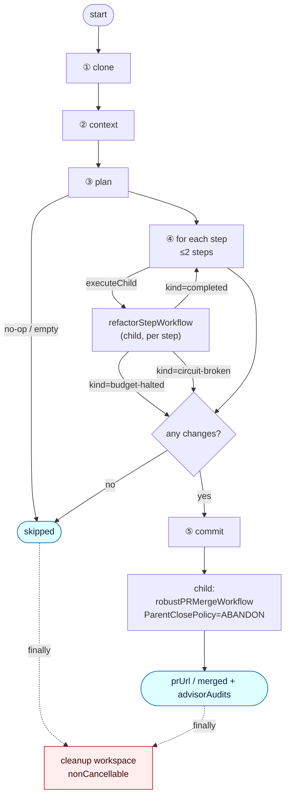
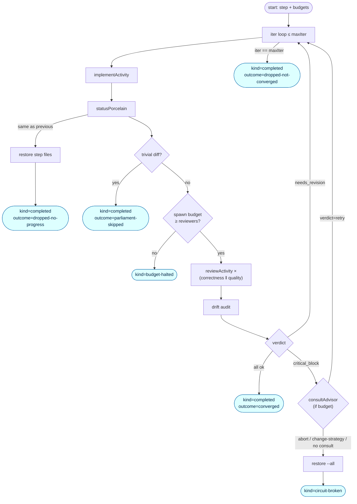
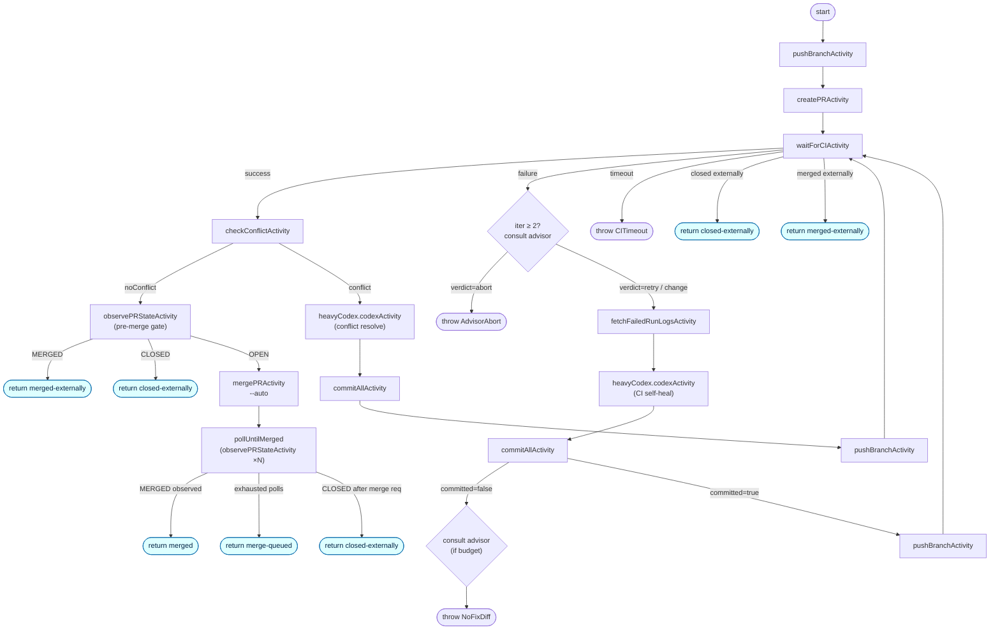
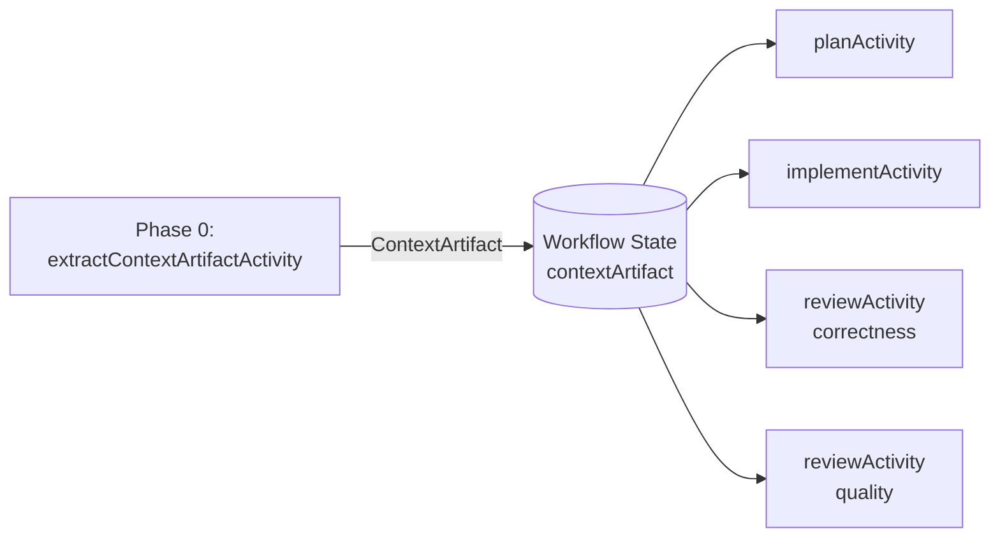

# Architecture

## Overview



> The current implementation is focused on periodic refactoring via codex.  
> `refactorStepWorkflow` (implement → review loop) and `robustPRMergeWorkflow` (push → CI → merge)  
> are designed as reusable child workflows, making it straightforward to add issue-driven routes later.

---

## Activity directory structure

Activities are grouped by concern under `internal/activity/`. Each group is a Go package with an `Activities` struct whose methods are registered with the Temporal worker.

```
internal/
├── activity/
│   ├── codex/activities.go      # DesignActivity, ImplementActivity, ReviewActivity,
│   │                            #   ChatActivity, ConsultAdvisorActivity
│   ├── git/activities.go        # CloneRepoActivity, CommitAllActivity, PushBranchActivity,
│   │                            #   StatusPorcelainActivity, DiffStatActivity,
│   │                            #   RestoreActivity, CleanupWorkspaceActivity,
│   │                            #   CheckConflictActivity
│   └── github/activities.go     # CreatePRActivity, WaitForCIActivity,
│                                #   FetchFailedRunLogsActivity, MergePRActivity,
│                                #   ObservePRStateActivity
├── codex/client.go              # codex CLI subprocess wrapper (RunOptions → stdout)
├── errors/errors.go             # Typed ApplicationFailures (nonRetryable sentinels)
├── workflow/
│   ├── periodic.go              # PeriodicRefactorWorkflow (orchestrator)
│   ├── design_phase.go          # DesignPhaseWorkflow (plan → review loop)
│   ├── refactor_step.go         # RefactorStepWorkflow (implement → review loop)
│   └── pr_lifecycle.go          # RobustPRMergeWorkflow (push → CI → merge)
└── workspace/
    ├── manager.go               # GetOrCreate / Session (thread-safe session map)
    └── session.go               # WorkDir / Branch per session
```

---

## codex transport

`internal/codex/client.go` invokes the `codex` binary as a subprocess (`codex exec`). `auth.json` must be at `$HOME/.codex/auth.json` (or override with `$CODEX_HOME`).

All codex invocations use `--sandbox danger-full-access`. The Pod is the isolation boundary — it runs non-root with restricted network egress. bubblewrap-based sandbox modes (`workspace-write`, `read-only`) are not used because they require unprivileged user-namespace support that varies by cluster.

---

## Workflow responsibilities

### `periodicRefactorWorkflow`

The orchestrator. Runs five phases: clone → context → plan → step-loop → PR handoff, with a `finally` cleanup block.

The step loop delegates each step's implement → Parliament → drift-audit → critical_block handling to `refactorStepWorkflow` (one child per step via `executeChild`). The parent passes remaining `spawnBudget` / `advisorBudget` to each child and accumulates the deltas returned in the child's output (delta-sync pattern). PR body generation is handled by `_internal/refactor-report.ts` (`renderReport()`); spawn accounting is handled by `_internal/spawn-budget.ts` (`SpawnCounter`).



Guards omitted from the diagram (present in `internal/workflow/periodic.go`):
- Steps are capped at `maxStepsPerRun` (default 2).
- On `circuit-broken`, the parent stops the step loop early.

---

### `refactorStepWorkflow` (child — per step)

Launched once per plan step by `executeChild`. Can be reused as-is by any future orchestrator.



Return value fields:

| Field | Type | Meaning |
| --- | --- | --- |
| `kind` | `'completed' \| 'budget-halted' \| 'circuit-broken'` | Whether the parent should continue to the next step |
| `record` | `StepRecord?` | Undefined only when `kind === 'budget-halted'` |
| `circuitBroken` | `CircuitBreaker?` | Set only when `kind === 'circuit-broken'` |
| `spawnCounts` | `Record<string, number>` | codex calls consumed by this child, by role |
| `advisorConsumed` | `number` | Advisor consults consumed by this child |
| `advisorAudits` | `AdvisorAuditEntry[]` | Audit entries for advisor consults in this child |

`WorkDir` is passed from the parent via the session ID and used as-is (both run on the same Worker pod).

---

### `robustPRMergeWorkflow` (child)



Repairs CI failures and conflicts up to `maxFixIterations`. The advisor is called at most `maxAdvisorConsults` times (default 2) — once for CI self-heal (when `iter ≥ 2`) and once for no-diff. Each advisor call receives only a pre-aggregated summary (≤ 2 KiB). Only `verdict: abort` stops the workflow; `retry` and `change-strategy` continue to the next self-heal (the suggestion is recorded in the audit log and PR body).

#### `RobustPRMergeOutput.outcome` values

| Outcome | Meaning | `merged` flag |
| --- | --- | --- |
| `merged` | Merge landed — `mergedAt` was observed | `true` |
| `merge-queued` | `--auto` accepted by gh but protection gate not yet cleared | `false` |
| `auto-merge-disabled` | Caller passed `autoMerge: false` | `false` |
| `closed-externally` | PR was closed by another PR or a person | `false` |
| `merged-externally` | Base force-push or manual merge — MERGED observed | `true` |

`closed-externally` and `merged-externally` return normally (no throw). Each CI poll reads `gh pr view --json state` to detect external OPEN/CLOSED/MERGED transitions, converting them into early exits.

---

## Activity proxy mapping

| Proxy | `startToCloseTimeout` | Retries | Activities |
| --- | --- | --- | --- |
| `cheap` | 2 m | 5×, exp ×2, max 30 s | lightweight git plumbing, single gh reads |
| `heavy` | 20 m | 4×, exp ×2, max 5 m | clone, push |
| `contextCodex` / `planCodex` / `reviewCodex` | 5 m | 5×, exp ×3, max 10 m | short codex roles |
| `implementCodex` | 30 m | 5×, exp ×3, max 10 m | implement role (longer) |
| `heavyCodex` | 90 m | 5×, exp ×3, max 10 m | CI self-heal / conflict resolution in pr-lifecycle |
| `advisor` | 4 m | 3×, exp ×2, max 2 m | consultAdvisorActivity |
| `ciWait` | 70 m | 3× | waitForCIActivity (heartbeat + polling) |

All LLM proxies share `codexQuotaFriendlyRetry`: `RateLimited` errors get exponential backoff (up to 10 min, 5 attempts). `PlannerOutputInvalid`, `MissingCredentials`, and `InvalidGitRef` are in `nonRetryableErrorTypes` — they fail immediately regardless of proxy retry policy.

---

## Advisor consults

The advisor is a single Activity (`consultAdvisorActivity`) that queries a higher-capability model for a decision at specific workflow gates. It never modifies code — it only returns `{verdict, rationale, suggested_action}`. Workflows call it via `consultAdvisor()` in `workflows/_internal/advisor.ts`.

### Invocation gates

| Gate | Location | Default behavior | Advisor effect |
| --- | --- | --- | --- |
| `ci-self-heal` | pr-lifecycle, CI red at iter ≥ 2 | continue self-heal | `abort` throws `AdvisorAbort` |
| `no-diff` | pr-lifecycle, codex produced no diff | throw `NoFixDiff` | audit record only (throw is unchanged) |
| `critical-block` | periodic, reviewer returns `critical_block` | restore all + exit | only `retry` takes effect (demotes to `needs_revision`) |

### I/O contract

Input (aggregated by caller, ≤ ~2 KiB):
- `situation`: one line describing the decision point
- `summary`: compressed context (failed job names, top issues, iteration count, etc.)
- `options`: candidate actions the workflow could take

Output JSON:
```json
{ "verdict": "retry" | "abort" | "change-strategy", "rationale": "...", "suggested_action": "..." }
```

### Budget

| Workflow | Default cap | Override |
| --- | --- | --- |
| `robustPRMergeWorkflow` | `maxAdvisorConsults = 2` | Configurable in input |
| `periodicRefactorWorkflow` | `maxAdvisorConsults = 1` | `0` to disable entirely |

`AdvisorBudget` is a workflow-local counter in `_internal/advisor.ts`. It is **consumed before the Activity is awaited**, so a failed activity still counts against the budget (this prevents exponential retry loops).

### Failure modes

If `consultAdvisorActivity` throws `AdvisorOutputInvalid`, exhausts retries on `RateLimited`, or the budget is zero, `consultAdvisor()` returns `reply: undefined` with an audit entry. The caller treats this as "no consult" and falls through to the default branch (continue self-heal / restore all / throw `NoFixDiff`).

### Audit trace

Each consult is recorded as `AdvisorAuditEntry { gate, situation, reply?, error? }` and collected in `PeriodicRefactorOutput.advisorAudits` / `RobustPRMergeOutput.advisorAudits`. `renderReport()` adds an **"## Advisor consults"** section to the PR body showing verdict and rationale. Consults from pr-lifecycle occur after PR body generation, so they appear only in the workflow output, not in the PR body.

---

## ContextArtifact pattern



At workflow start, a single codex call distils a repository summary (`overview / conventions / interfaces`) into a `ContextArtifact`. All subsequent role prompts include this artifact as a **static preamble**, so the LLM provider's prompt cache hits across plan / implement / review calls within the same workflow run (same prefix bytes).

```
[ STATIC, cacheable ]                                    [ DYNAMIC, per-call ]
┌─────────────────────────────────────────────┐  ┌────────────────────────────┐
│ Global hard rules                            │  │ step JSON / diff /         │
│ Repository Context Artifact                  │  │ prior reviewer feedback    │
│ Role identity + checklist + output schema   │  │                             │
└─────────────────────────────────────────────┘  └────────────────────────────┘
```

---

## State management

### Workspace

Repos are cloned to `os.tmpdir()/repo-steward-workspaces/<repo>__<random>` (or `$WORKSPACE_ROOT/<repo>__<random>` when `WORKSPACE_ROOT` is set). `cleanupWorkspaceActivity` removes it in the `finally` block.

`baseBranch` is explicitly fetched as `refs/remotes/origin/<baseBranch>` after the shallow clone, and `agent/refactor/<workflow-id>` is checked out from that remote-tracking ref. This avoids `git checkout` failures on repos where `develop`, `release/*`, etc. are not the default branch.

### Branch naming

`agent/refactor/<workflow-id>` — unique per schedule invocation via `workflowInfo().workflowId`.

---

## Determinism constraints

- Workflows must not call `Date.now()`, `Math.random()`, `process.env`, or `fs` directly.
- Use heartbeating Activities or `workflow.sleep()` for waiting. `setTimeout` is not safe in Workflows.
- Generate IDs from `workflowInfo().workflowId` or return them from Activities.
- Do not place side-effectful code at the top level of a workflow file. Even `workflowInfo()` must be called inside a function.
- `extractContextArtifactActivity`'s `generatedAt` is derived from `workflowInfo().startTime` (deterministic).

---

## Activities catalog

All Activities are registered with the Worker in `cmd/main.go`.

### `git/` — workspace + git plumbing

| Activity | File | Role |
| --- | --- | --- |
| `CloneRepoActivity` | `internal/activity/git/activities.go` | Clone + create `agent/refactor/<id>` branch |
| `CommitAllActivity` | `internal/activity/git/activities.go` | `git add -A` + commit. Returns error on empty diff |
| `PushBranchActivity` | `internal/activity/git/activities.go` | `git push` (supports `-u` / `--force-with-lease`) |
| `CheckConflictActivity` | `internal/activity/git/activities.go` | Trial merge against base → returns conflict boolean |
| `CleanupWorkspaceActivity` | `internal/activity/git/activities.go` | Delete workdir |
| `DiffStatActivity` | `internal/activity/git/activities.go` | `git diff --stat HEAD` |
| `StatusPorcelainActivity` | `internal/activity/git/activities.go` | `git status --porcelain` snapshot |
| `RestoreActivity` | `internal/activity/git/activities.go` | `git restore .` + `git clean -fd` (rollback) |

### `github/` — gh CLI

| Activity | File | Role |
| --- | --- | --- |
| `CreatePRActivity` | `internal/activity/github/activities.go` | `gh pr create` + view to get `{Number, URL}` |
| `WaitForCIActivity` | `internal/activity/github/activities.go` | Poll `statusCheckRollup` + `state`. Detects external close/merge |
| `FetchFailedRunLogsActivity` | `internal/activity/github/activities.go` | `gh run view --log-failed` (input to codex self-heal) |
| `MergePRActivity` | `internal/activity/github/activities.go` | `gh pr merge --auto --squash --delete-branch` |
| `ObservePRStateActivity` | `internal/activity/github/activities.go` | `gh pr view --json state,mergedAt` (post-merge poll) |

### `codex/` — LLM

| Activity | File | Role |
| --- | --- | --- |
| `DesignActivity` | `internal/activity/codex/activities.go` | Clone workspace + generate refactoring plan |
| `ImplementActivity` | `internal/activity/codex/activities.go` | Apply one step to the working tree |
| `ReviewActivity` | `internal/activity/codex/activities.go` | Per-concern reviewer (correctness / quality / design) |
| `ChatActivity` | `internal/activity/codex/activities.go` | General-purpose codex prompt (CI self-heal) |
| `ConsultAdvisorActivity` | `internal/activity/codex/activities.go` | Structured verdict at decision gates |

---

## Configuration reference

### Worker environment variables

| Variable | Required | Default | Purpose |
| --- | --- | --- | --- |
| `TEMPORAL_ADDRESS` | yes | `localhost:7233` | Temporal Frontend gRPC endpoint |
| `TEMPORAL_NAMESPACE` | no | `default` | Temporal namespace |
| `TEMPORAL_TASK_QUEUE` | no | `repo-steward` | Shared queue name for Worker and Client |
| `TEMPORAL_TLS` | no | `false` | Set `true` to enable mTLS |
| `TEMPORAL_MAX_CONCURRENT_ACTIVITIES` | no | `4` | Activity slot count (directly affects codex parallelism) |
| `TEMPORAL_MAX_CONCURRENT_WORKFLOWS` | no | `20` | Workflow task slot count |
| `GITHUB_TOKEN` | yes | — | Auth for `gh` and `git push`. Fine-grained PAT recommended |
| `GIT_BOT_NAME` | no | `repo-steward-bot` | `user.name` for auto-commits |
| `GIT_BOT_EMAIL` | no | `repo-steward-bot@users.noreply.github.com` | `user.email` for auto-commits |
| `CODEX_BIN` | no | `codex` | Path to the codex CLI binary |
| `CODEX_MODEL` | no | (codex default) | Model passed to `codex --model`. Use Opus or equivalent in production |
| `WORKSPACE_ROOT` | no | `/workspaces` | Root directory for cloned repos. Set to a mounted volume path |
| `REGISTER_SCHEDULE` | no | `false` | Set `true` to install the Temporal schedule on startup |
| `SCHEDULE_ID` | no | `repo-steward-periodic-refactor` | Temporal schedule ID |
| `SCHEDULE_CRON` | no | `0 3 * * 1` | Cron expression for the periodic schedule |
| `TARGET_REPO` | no | — | `owner/name` — used when `REGISTER_SCHEDULE=true` |
| `REFACTOR_BRIEF` | no | — | User instructions passed to the planner |
| `BASE_BRANCH` | no | `main` | Base ref to clone and target for merge |
| `AUTO_MERGE` | no | `false` | Set `true` to merge automatically when CI is green |

### `PeriodicRefactorWorkflow` input (`PeriodicRefactorInput`)

| Field | Type | Default | Description |
| --- | --- | --- | --- |
| `RepoFullName` | `string` | required | `owner/name` |
| `BaseBranch` | `string` | `main` | Base ref to clone and target for merge |
| `Brief` | `string` | required | User instructions passed to the planner |
| `PRTitle` / `PRBody` | `string` | required | PR display text |
| `AutoMerge` | `bool` | `false` | `true` merges automatically when CI is green |

### `RefactorStepWorkflow` input (`RefactorStepInput`)

| Field | Type | Description |
| --- | --- | --- |
| `SessionID` | `string` | Workspace session from the design phase |
| `Step` | `Step` | One step from the planner's output (`Title` + `Description`) |
| `ContextArtifact` | `string` | Path to the context artifact file |

### `RobustPRMergeWorkflow` input (`RobustPRMergeInput`)

| Field | Type | Default | Description |
| --- | --- | --- | --- |
| `RepoFullName` | `string` | required | `owner/name` |
| `WorkDir` | `string` | required | Workspace path provisioned by the design phase |
| `Branch` | `string` | required | Branch to push |
| `BaseBranch` | `string` | required | Merge target |
| `PRTitle` / `PRBody` | `string` | required | PR display text |
| `SessionID` | `string` | required | Session ID for codex self-heal |
| `AutoMerge` | `bool` | `false` | `true` merges automatically when CI is green |

### Workflow hard-coded constants

| Constant | Location | Value | Meaning |
| --- | --- | --- | --- |
| `maxStepsPerRun` | `internal/workflow/periodic.go` | `2` | Maximum steps taken from the planner output |
| `maxStepIter` | `internal/workflow/refactor_step.go` | `2` | implement → review loop iteration cap per step |
| `maxDesignRounds` | `internal/workflow/design_phase.go` | `2` | Plan review + refine loop cap |
| `maxFixIterations` | `internal/workflow/pr_lifecycle.go` | `8` | CI self-heal iteration cap |
| `postMergePollAttempts` | `internal/workflow/pr_lifecycle.go` | `6` | Merge-observation poll count |
| CI poll interval | `internal/activity/github/activities.go` | `30s` | `WaitForCIActivity` polling interval |
| CI max wait | `internal/activity/github/activities.go` | `3600s` | CI wait upper bound |

---

## ApplicationFailure type catalog

`ApplicationFailure.type` values visible in the Temporal Web UI. "Retryable?" shows whether the error is retried at the Activity level. `nonRetryable` errors ignore the proxy's RetryPolicy and fail immediately. `workflow throw` errors terminate the Workflow itself.

| Type | Thrown by | Retryable? | Meaning and resolution |
| --- | --- | --- | --- |
| `InvalidGitHubOutput` | `internal/activity/github/activities.go` | No (nonRetryable) | Unexpected gh CLI JSON. Check gh version or API changes |
| `CITimeout` | `internal/activity/github/activities.go` | No | CI did not settle within max wait. Check GitHub Actions |
| `AdvisorAbort` | `internal/errors/errors.go` (workflow throw) | No | Advisor returned `verdict: abort`. Intentional early stop |
| `NoFixDiff` | `internal/errors/errors.go` (workflow throw) | No | codex produced no diff after CI failure. Check prompt / sandbox |
| `MaxIterations` | `internal/errors/errors.go` (workflow throw) | No | `maxFixIterations` exhausted without reaching CI green |

---

## Known limitations and future work

1. **workdir is pod-local**: The design phase provisions `WorkDir` and passes it via session ID to child workflows, assuming all run on the same Worker pod. When scaling, either pin Workflows to pods, move `WorkDir` to shared storage, or re-clone in each child.
2. **codex CLI flags are version-sensitive**: Arguments are matched to the documented API at build time. Pin the version in CI; absorb breaking changes in `internal/codex/client.go`.
3. **Replay tests not set up**: Adding history-replay tests to CI would make it safe to version long-lived Workflows like `RobustPRMergeWorkflow`.
4. **Issue-driven route**: To handle `ai-ready`-labelled issues, add GitHub list/update activities and build `issuePollerWorkflow` → `issueDrivenWorkflow` → `RobustPRMergeWorkflow`.
5. **Alternative LLM**: To add Claude or another model, add a new activity package and register it. The current codex-only setup is intentional; the architecture does not preclude adding more.
6. **`change-strategy` verdict is treated as `retry`**: The advisor can return `change-strategy` but the current implementation handles it identically to `retry`. A future branch could implement concrete actions.
